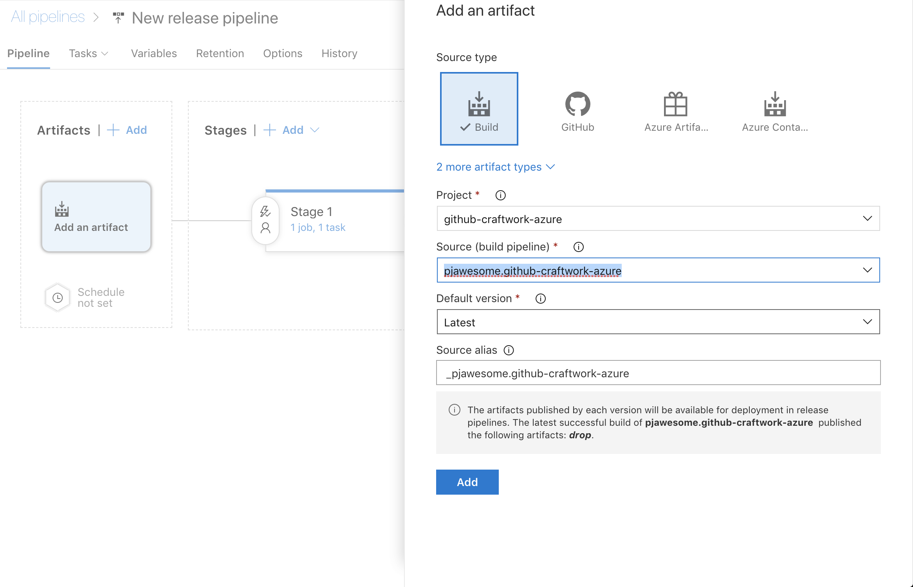
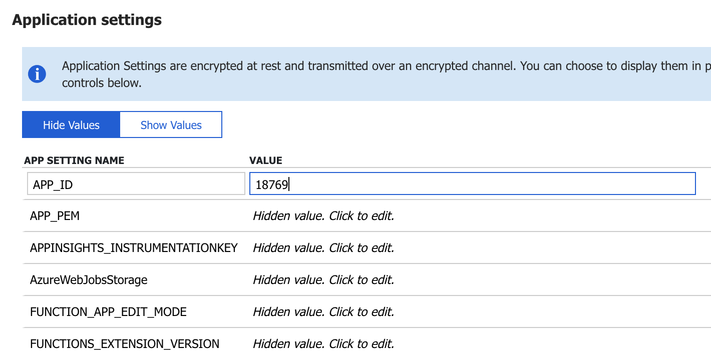

# GitHub Craftwork on Azure – Workshop Instructions
This README contains the accompanying instructions for the follow-along workshop. Follow the steps below in order to build your first GitHub App, an automated GitHub issue moderator bot, running on Azure Functions and deployed via Azure DevOps Pipelines.

## Prerequisites

A GitHub account, an Azure account (see below) and a browser are the only mandatory requirements.

**Please note**: For the Azure DevOps Pipelines integration to work, a GitHub Account and a Microsoft account are needed. However for the Azure Function Apps deployment to work, you are going to need a Microsoft Azure account with a free subscription. We will provide Promo Codes to allow you to sign-up without having to use your creditcard details for verification.

## Instructions

Ensure you have a working GitHub account, a Microsoft account, and [an Azure account with an active subscription](https://signup.azure.com ) (a free trial is available during signup – a phone number and a credit card are **required** although [no money will be exchanged](https://azure.microsoft.com/en-gb/offers/ms-azr-0044p/)).

:bulb: **Tip:** Open a new Tab in your browser for every tool we are going to use as we will go back and forth between: GitHub, Azure DevOps (Pipelines) and Azure Portal, 

## Step 1. Setup Azure Portal account

1. Copy the Azure Promo Code you have received from us

**Note:** If you haven't received a code, please let us know.

2. Visit: https://www.microsoftazurepass.com/
3. Use a Microsoft account or create one (you will also use this account later to sign-in on Azure DevOps)
4. Follow the steps in the SubmitPromoCode form
5. Log in on the [Microsoft Azure portal](https://portal.azure.com/)
6. Click on `Create a resource` -> `Compute` -> `Function App`
7. We will configure the Function App later.

:tada: Congrats, you now have an Azure Portal account.

## Step 2. Fork repository and enable Issues

1. Log in to your GitHub account
2. Fork this repository: https://github.com/octodemo/github-craftwork-azure
3. Enable repository `Issues` (under Settings)

## Step 3. Install Azure DevOps Pipelines to your repository

1. Go to [Azure Pipelines · GitHub Marketplace · GitHub](https://github.com/marketplace/azure-pipelines)
	1. Select the `Free` plan
	2. Click `Install it for free`
2. Install Pipelines selecting the newly created repo in the dropdown
	1. Sign into your Azure DevOps account using your Microsoft account
	2. Create a new Organization for the Pipelines project, for example using your GitHub handle as a name
	3. Pick a region close to you
	4. Name your Pipelines project something like `github-craftwork-azure`
3. The Azure Pipelines project is now set up and integrated with your GitHub repository.
	1. Select the repository for creating the new pipeline
	2. Do not modify the pipeline definition YAML file
	3. Click `RUN` and wait until the build finishes successfully

💡 Congrats! You have integrated an automated CI tool using Azure DevOps Pipelines on your repository.

## Step 4. Create a new Azure Function App project in the Azure Portal

Our next step will be to create the Azure Function App where our code will be deployed.

1. Log in on the [Microsoft Azure portal](https://portal.azure.com/)
2. Click on `Create a resource` -> `Compute` -> `Function App`

*Our function configuration*

:warning: *Important:* please make sure to select `JavaScript` as the Runtime Stack as the default is `.NET`.

3. Confirm and wait for the new resource to be deployed.

## Step 5. Create a new Release Pipeline to automatically deploy our changes

Let's go back to [Azure Pipelines](https://dev.azure.com).

1. Click on Releases
	1. New Pipeline
	2. Azure App Service deployment
		1. Create “Deploy to Azure Functions” stage
		2. Click on the job/task link in the UI
		3. Fill the subscription form -> Authorize
			1. Wait for `Configuring the Azure service connection...` to disappear
		4. Select your Function App from the 2nd dropdown
		5. Save (top right)
		6. Select the build pipeline as a source for the Artifact:

		7. Enable the Continuous deployment trigger

1. Go back to Builds
	1. Click on Queue build
		1. This will create a new release artifact
		2. Wait for the build to finish

2. Back to Releases, follow the release

3. Verify the function has been deployed in Azure -> Function Apps

💡 Awesome! We have now a complete CI/CD pipeline that automatically ships code when things change on our repository!

## Step 6. Create our GitHub App

We are now ready to create a GitHub App that will send webhooks to our app running on Azure. 

In the Azure Function App dashboard, click on your function for “ModerateIssue”. Click on the `Get URL` button and copy the URL in your text editor (we are going to need this soon). Do the same for the `GitHub Secret` next to it.
	

Now visit [this page](https://octodemo.github.io/github-craftwork-azure/). Here we will create our GitHub app from a [manifest](https://developer.github.com/apps/building-github-apps/creating-github-apps-from-a-manifest/). This is a preconfigured GitHub App you can share with anyone who wants to use your app in their personal repositories, like we are doing for this workshop.

> 💡 If you want to create an app from scratch, you can do this on the [app settings page](https://github.com/settings/apps). This guide is focused on creating an app from a manifest.

1. Paste the function URL you copied from the Azure Function into the textfield on [this page](https://octodemo.github.io/github-craftwork-azure/)
2. Click the submit button and give your app a name. This name has to be unique. Submit it. 
3. Copy the APP_ID & APP_PEM from step 2 and use them as a application setting.

4. Open your [app settings](https://github.com/settings/apps) in GitHub and paste the webhook secret we copied from the Azure Function.

💡 Woah! You buily your first GitHub App! Congratulations, human!

## Step 7. Alpha version: post a basic reply

Create a new Issue in your repository and wait for the bot to post a "hello world" reply. This is the very first step towards real, AI-driven moderation. That is because the master branch only contains a basic version of our function that only posts a basic response.

Next we will create a Pull Request to merge the contents of the `assign-label-to-new-issues` branch which contains a slightly different version of the basic demo code that will add a predetermined label to any new issue. This is so you get familiar with the pull request flow and so that we can verify that our Azure DevOps CI builds are running properly.

1. Navigate to the `Code` section of your repository
2. Click on the `branch` dropdown and select `assign-label-to-new-issues`
3. Click on the `new pull request` button and confirm
4. Wait for Azure DevOps to repurt the build ran successfully
5. Merge the pull request
6. Wait for the check next to the last commit in the `Commits` tab to also report "green" 
7. Finally test the newly deployed version of the function by creating a new issue

At this point you should see the label `enhancement` applied to any newly created issue.

## Step 8. Turn on the AI moderation!

We need to repeat the above procedure but this time by switching to the branch `use-luis-to-label-issues`. 
Before we can do that, we need to extend the Application Settings on our Azure Function App to also add two more items.

The workshop organizers will share the LUIS application ID and secret token at this point so that your own Function app can connect to our pre-trained LUIS service API that will parse your issues and send back a response that we can parse to determine which label to apply to the issue. 

Once the pull request is merged and the new version deployed, you will finally see that the issues will get one of the 3 labels `bug`, `enhancement` and `question` applied automatically based on the input issue title. This is powered by the AI-driven cognitive services running on Microsoft LUIS.

### Further Reading

- GitHub App Walkthrough [octokit.net/github-apps.md at master · octokit/octokit.net · GitHub](https://github.com/octokit/octokit.net/blob/master/docs/github-apps.md#github-app-walkthrough) 
- VS CODE functions
[Create your first function in Azure using Visual Studio Code | Microsoft Docs](https://docs.microsoft.com/en-us/azure/azure-functions/functions-create-first-function-vs-code)

