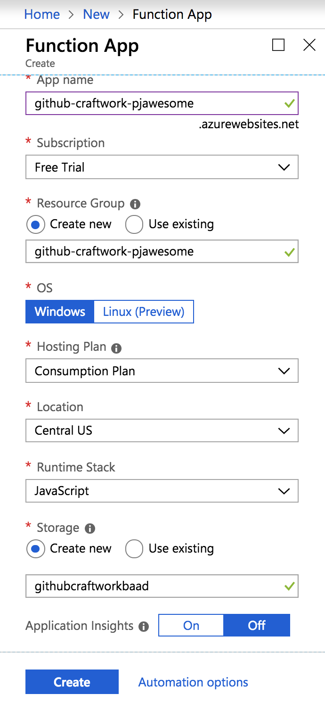
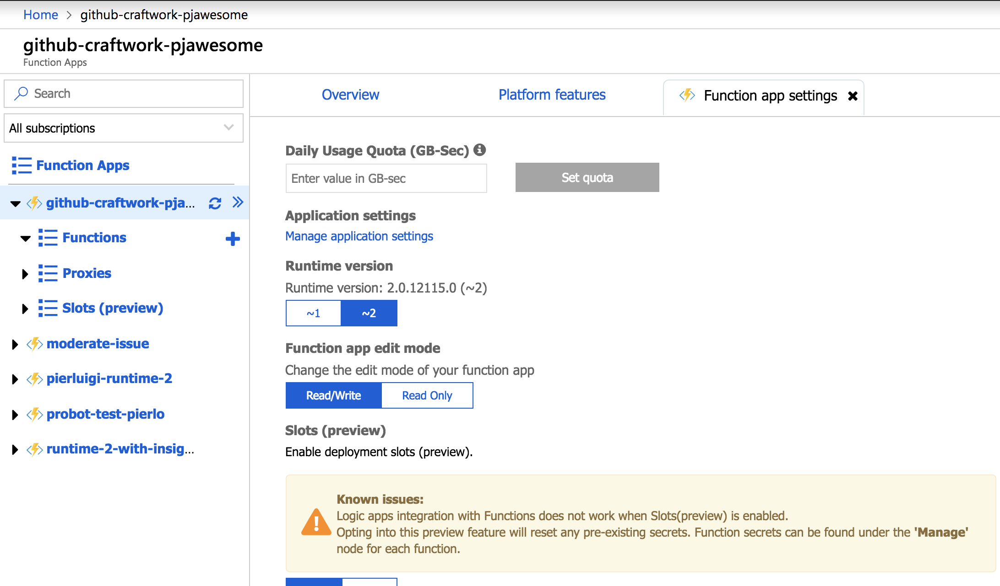
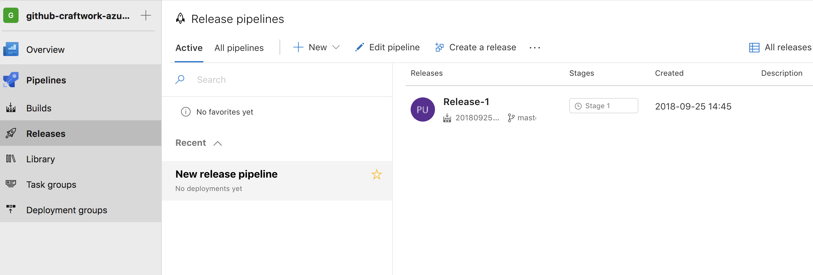
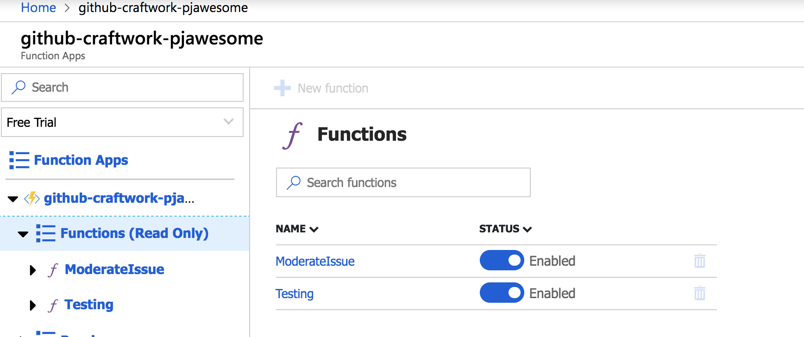
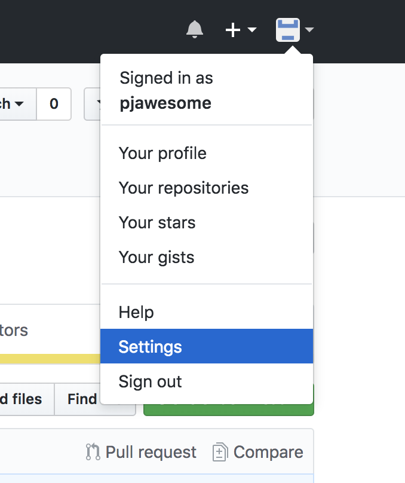
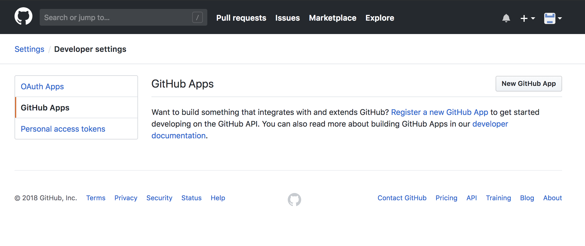
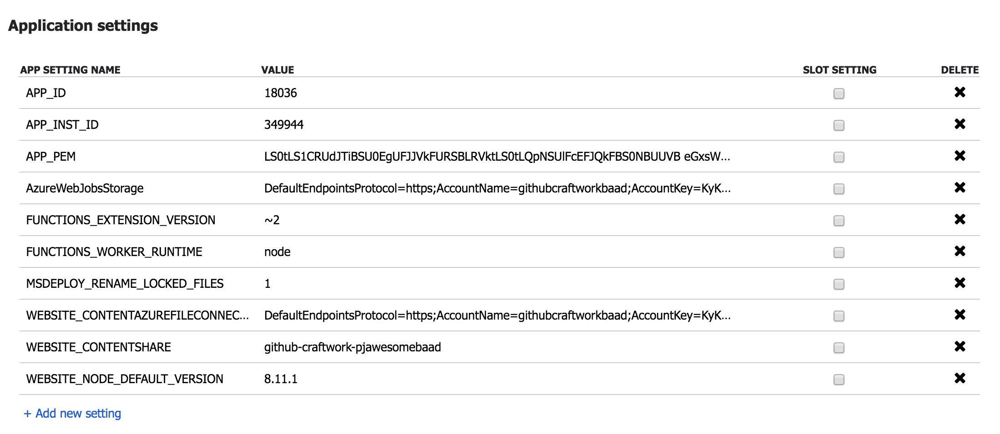

# GitHub Craftwork on Azure – Workshop
This README contains the accompanying instructions for the follow-along workshop. Follow the steps below in order to build your first GitHub App, an automated GitHub issue moderator bot, running on Azure Functions and deployed via Azure DevOps Pipelines.

## Prerequisites

A GitHub account, an Azure account and a browser are the only mandatory requirements.

Please note: For the Azure DevOps Pipelines integration to work, only a GitHub Account is needed. However for the Azure Function Apps deployment to work, you are going to need a separate Azure account. Although a free trial version with a time restriction is available for Azure Functions, it signup page seems to have stopped working (see https://github.com/projectkudu/TryAppService/issues/87). It may be possible to remove the requirement on an Azure account if that resumes working at a later point.

## Instructions

Ensure you have a working GitHub account, and [an Azure account with an active subscription](signup.azure.com ) (a free trial is available during signup, but a phone number and a credit card are required).

## Step 1. Fork repo, install Pipelines build

1. Log in on GitHub
2. Fork this repository: https://github.com/pierluigi/github-craftwork-azure
3. Enable `Issues` (under Settings)
4. Go to [Azure Pipelines · GitHub Marketplace · GitHub](https://github.com/marketplace/azure-pipelines)
	1. Select the `Free` plan
	2. Click `Install it for free`
5. Install Pipelines selecting the newly created repo in the dropdown
	1. Sign into your Azure credentials
	2. Create a new Organization for the Pipelines project
	3. Pick region close to you
	4. Name Pipelines project `github-craftwork-azure`
6. The Azure Pipelines project is now set up and integrated with your GitHub repository.
	1. Select the repository for creating the new pipeline
	2. Leave the yml file alone
	3. Click RUN
	4. Check the build works

**Now let’s create the Function App**

1. [Microsoft Azure](https://portal.azure.com/)
2. Click on Create -> Compute -> Function App

3. Confirm and wait for deployment 
4. Click on Function Apps in the nav menu
5. Verify Runtime 2.0

This gives us Node > 8

**Let’s deploy our function from GitHub**

Back to Pipelines
https://dev.azure.com/

6. Click on Releases
	1. New Pipeline
	2. Azure App Service deployment
		1. Create “Deploy to Azure Functions” stage

		3. Click on the job/task link in the UI
		4. Fill the subscription form -> Authorize
			1. Wait for `Configuring the Azure service connection...` to disappear
		5. Select your Function App from the 2nd dropdown
		6. Save (top right)
		7. Select the build pipeline as a source for the Artifact 

		8. Enable the Continuous deployment trigger

1. Go back to Builds
	1. Click on Queue build
		1. This will create a new release artifact
		2. Wait for the build to finish

2. Back to Releases, follow the release

3. Verify the function has been deployed in Azure -> Function Apps

5. Click on “ModerateIssue”
	1. Click on get URL  copy it somewhere (`https://github-craftwork-pjawesome.azurewebsites.net/api/ModerateIssue?clientId=default`)
	2. Click on get GitHub Secret, copy it somewhere (`98BxXWy3AhoWr2LnMkhsNqsFm905cefiovleA4SYch1hMmFILaMiAA==`)
	

**Let’s create a GitHub App**
1. 

https://github.com/settings/developers

1. Generate APP
2. Download key
3. Save APP ID `18036` and Installation ID
4. Install app on the repo

Now back to Azure Function Apps
1. Select app -> Application Settings
2. Add new setting in the list: APP_ID 18036
3. Add new setting in the list: APP_INST_ID 18036 (**TODO GET FROM WEBHOOK**)

**Encoding the secret key**
- [ ] MacOS: `cat azure-moderate-issue.2018-09-24.private-key.pem | openssl base64 | pbcopy`
	- [ ] Else : https://www.base64decode.org/ 
	
5. Add new setting in the list APP_PEM with the bse64 encoded stirng of your pem

### Reading material

- [ ] GitHub App Walkthrough [octokit.net/github-apps.md at master · octokit/octokit.net · GitHub](https://github.com/octokit/octokit.net/blob/master/docs/github-apps.md#github-app-walkthrough) 

VS CODE functions
[Create your first function in Azure using Visual Studio Code | Microsoft Docs](https://docs.microsoft.com/en-us/azure/azure-functions/functions-create-first-function-vs-code)

FURTHER READING
[Getting Key Vault Secrets in Azure Functions – Statuscode – Medium](https://medium.com/statuscode/getting-key-vault-secrets-in-azure-functions-37620fd20a0b)
